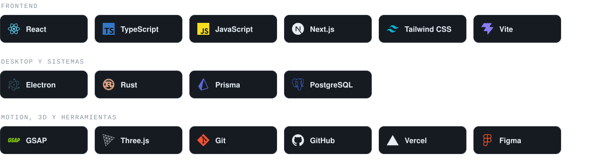
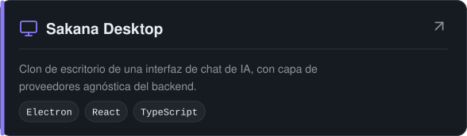
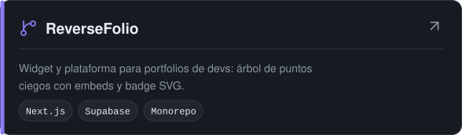
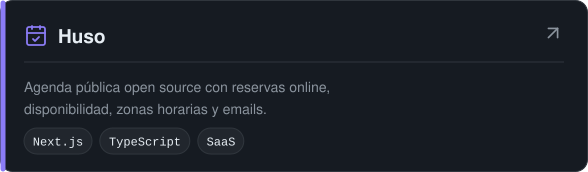

<picture><source media="(prefers-color-scheme: dark)" srcset="assets/banner-dark.svg"><source media="(prefers-color-scheme: light)" srcset="assets/banner-light.svg"></picture>

 

<a href="https://luciano-rodriguez.vercel.app/"><picture><source media="(prefers-color-scheme: dark)" srcset="assets/btn-portafolio-dark.svg"><source media="(prefers-color-scheme: light)" srcset="assets/btn-portafolio-light.svg"></picture></a>
<a href="https://www.linkedin.com/in/kilorito"><picture><source media="(prefers-color-scheme: dark)" srcset="assets/btn-linkedin-dark.svg"><source media="(prefers-color-scheme: light)" srcset="assets/btn-linkedin-light.svg"></picture></a>
<a href="https://github.com/kilorito2?tab=repositories"><picture><source media="(prefers-color-scheme: dark)" srcset="assets/btn-github-dark.svg"><source media="(prefers-color-scheme: light)" srcset="assets/btn-github-light.svg"></picture></a>

 

<picture><source media="(prefers-color-scheme: dark)" srcset="assets/h-about-dark.svg"><source media="(prefers-color-scheme: light)" srcset="assets/h-about-light.svg"></picture>

Soy estudiante de la **Tecnicatura Universitaria en Programación** en la **UTN Tucumán** (Argentina) y desarrollo software de forma independiente. Trabajo principalmente con **React, TypeScript y Tailwind CSS** para la web, y con **Electron** y **Rust** para aplicaciones de escritorio.

Me interesa construir productos completos: interfaces cuidadas, arquitectura clara y detalles de interacción bien resueltos. Mis proyectos van desde aplicaciones de escritorio y plataformas web hasta landings con animación y 3D.

 

<picture><source media="(prefers-color-scheme: dark)" srcset="assets/h-stack-dark.svg"><source media="(prefers-color-scheme: light)" srcset="assets/h-stack-light.svg"></picture>

<picture><source media="(prefers-color-scheme: dark)" srcset="assets/stack-dark.svg"><source media="(prefers-color-scheme: light)" srcset="assets/stack-light.svg"></picture>

 

<picture><source media="(prefers-color-scheme: dark)" srcset="assets/h-projects-dark.svg"><source media="(prefers-color-scheme: light)" srcset="assets/h-projects-light.svg"></picture>

<table>
<tr><td width="50%" valign="top"><a href="https://github.com/kilorito2/sakana-desktop"><picture><source media="(prefers-color-scheme: dark)" srcset="assets/card-sakana-desktop-dark.svg"><source media="(prefers-color-scheme: light)" srcset="assets/card-sakana-desktop-light.svg"></picture></a></td><td width="50%" valign="top"><a href="https://github.com/kilorito2/reversefolio"><picture><source media="(prefers-color-scheme: dark)" srcset="assets/card-reversefolio-dark.svg"><source media="(prefers-color-scheme: light)" srcset="assets/card-reversefolio-light.svg"></picture></a></td></tr>
<tr><td width="50%" valign="top"><a href="https://github.com/kilorito2/navegador-rust"><picture><source media="(prefers-color-scheme: dark)" srcset="assets/card-navegador-rust-dark.svg"><source media="(prefers-color-scheme: light)" srcset="assets/card-navegador-rust-light.svg"></picture></a></td><td width="50%" valign="top"><a href="https://github.com/kilorito2/Open-source-scheduling-SaaS"><picture><source media="(prefers-color-scheme: dark)" srcset="assets/card-open-source-scheduling-saas-dark.svg"><source media="(prefers-color-scheme: light)" srcset="assets/card-open-source-scheduling-saas-light.svg"></picture></a></td></tr>
<tr><td width="50%" valign="top"><a href="https://github.com/kilorito2/Climate-ESG-productivity-dashboard"><picture><source media="(prefers-color-scheme: dark)" srcset="assets/card-climate-esg-productivity-dashboard-dark.svg"><source media="(prefers-color-scheme: light)" srcset="assets/card-climate-esg-productivity-dashboard-light.svg"></picture></a></td><td width="50%" valign="top"><a href="https://github.com/kilorito2/lumen-studio"><picture><source media="(prefers-color-scheme: dark)" srcset="assets/card-lumen-studio-dark.svg"><source media="(prefers-color-scheme: light)" srcset="assets/card-lumen-studio-light.svg"></picture></a></td></tr>
</table>

 

<picture><source media="(prefers-color-scheme: dark)" srcset="assets/h-more-dark.svg"><source media="(prefers-color-scheme: light)" srcset="assets/h-more-light.svg"></picture>

<table>
<tr><th align="left">Proyecto</th><th align="left">Descripción</th><th align="left">Tecnologías</th></tr>
<tr><td><a href="https://github.com/kilorito2/Terra"><b>Terra</b></a></td><td>Landing inmersiva sobre cambio climático, con video de fondo y efecto liquid glass.</td><td><code>React · TypeScript · Tailwind v4</code></td></tr>
<tr><td><a href="https://github.com/kilorito2/Vex"><b>Vex</b></a></td><td>Landing sobre exploración y conservación del océano profundo.</td><td><code>React · TypeScript · Vite</code></td></tr>
<tr><td><a href="https://github.com/kilorito2/loam"><b>Loam</b></a></td><td>Landing editorial experimental con scroll suave y animaciones.</td><td><code>Next.js · GSAP · Lenis</code></td></tr>
<tr><td><a href="https://github.com/kilorito2/altitude-landing"><b>Altitude</b></a></td><td>Landing de inteligencia de datos orbitales.</td><td><code>Vite · CSS</code></td></tr>
<tr><td><a href="https://github.com/kilorito2/velmont-grand-hotel"><b>Velmont Grand Hotel</b></a></td><td>Landing de hotel de lujo en HTML, CSS y JavaScript.</td><td><code>HTML · CSS · JS</code></td></tr>
<tr><td><a href="https://simulador-de-trayectoria-de-proyect.vercel.app"><b>Simulador de proyectiles</b></a></td><td>Simulador web de la trayectoria de proyectiles.</td><td><code>TypeScript · Vite</code></td></tr>
<tr><td><a href="https://github.com/kilorito2/kiomusic-discord-bot"><b>KioMusic</b></a></td><td>Bot de música para Discord con filtros de audio, playlists y panel web.</td><td><code>Node.js · Discord</code></td></tr>
<tr><td><a href="https://github.com/kilorito2/Lanitas-Tejidas"><b>Lanitas Tejidas</b></a></td><td>Landing de un emprendimiento de tejidos a crochet.</td><td><code>React · Vite · Tailwind</code></td></tr>
</table>

 

<picture><source media="(prefers-color-scheme: dark)" srcset="assets/divider-dark.svg"><source media="(prefers-color-scheme: light)" srcset="assets/divider-light.svg"></picture>

Luciano Rodríguez López · Tucumán, Argentina

